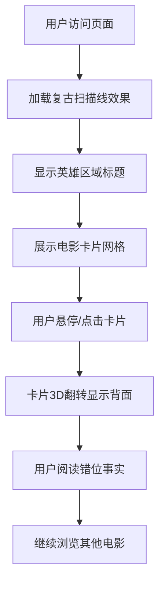

## 1. 产品概述

"90年代电影错位博物馆"是一个以复古录像带风格呈现的电影展示网页，通过幽默的"错位事实"重新想象经典90年代电影。目标用户为电影爱好者和怀旧文化粉丝，旨在提供有趣、独特的电影文化体验。

## 2. 核心功能

### 2.1 用户角色
| 角色 | 注册方式 | 核心权限 |
|------|----------|----------|
| 访客 | 无需注册 | 浏览电影卡片、翻转查看错位事实 |

### 2.2 功能模块
1. **首页**：英雄区域、电影卡片网格、页脚
2. **电影卡片**：正面（电影信息）、背面（错位事实）

### 2.3 页面详情
| 页面名称 | 模块名称 | 功能描述 |
|----------|----------|----------|
| 首页 | 英雄区域 | 标题、副标题、年代标签，带打字机效果 |
| 首页 | 电影卡片网格 | 10部电影卡片，支持3D翻转动画 |
| 首页 | 扫描线效果 | 全屏复古录像带扫描线动画 |
| 首页 | 页脚 | 版权信息、扩张性提示 |

## 3. 核心流程

用户进入页面 → 看到复古风格的英雄区域和扫描线效果 → 向下滚动浏览电影卡片 → 点击/悬停卡片翻转 → 查看错位事实 → 继续探索其他电影

## 4. 用户界面设计

### 4.1 设计风格
- **主色调**：深黑色（#0a0a0a）背景，霓虹绿（#39ff14）和 VHS 磁粉紫（#c77dff）作为强调色
- **辅助色**：雪花白噪点、扫描线透明灰
- **字体**：标题使用 "Press Start 2P" 像素字体，正文使用 "VT323" 终端字体
- **按钮风格**：无按钮，卡片本身为交互元素，翻转时有发光效果
- **布局风格**：卡片网格布局，不对称错位排列
- **视觉效果**：全屏扫描线动画、CRT 弯曲效果、信号干扰闪烁

### 4.2 页面设计概述
| 页面名称 | 模块名称 | UI 元素 |
|----------|----------|---------|
| 首页 | 英雄区域 | 像素字体标题、副标题、闪烁光标、年代标签 |
| 首页 | 电影卡片 | 正面：海报占位、标题、年份、导演、国家；背面：错位事实文案、引号装饰 |
| 首页 | 扫描线层 | 固定定位全屏覆盖，CSS 动画实现扫描效果 |
| 首页 | 背景 | 深色渐变 + 噪点纹理 + CRT 边缘暗角 |

### 4.3 响应性
- 桌面端：4列网格布局，卡片悬停翻转
- 平板端：3列网格布局
- 移动端：2列网格布局，点击翻转
- 触控设备：优化触摸目标大小

### 4.4 动效设计
- 页面加载：卡片依次淡入，带延迟错峰效果
- 卡片翻转：CSS 3D transform，0.6s 缓动动画
- 扫描线：从上到下无限循环，2s 周期
- 文字闪烁：标题偶尔出现信号干扰效果
- 悬停发光：霓虹色外发光效果
