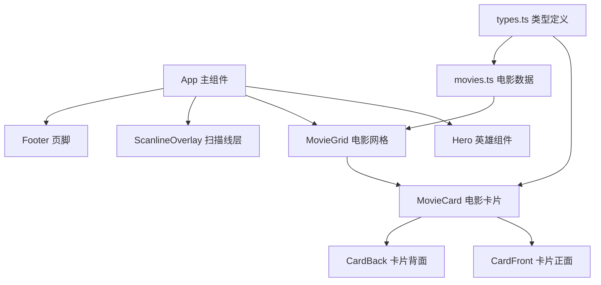

## 1. 架构设计

纯前端单页应用，采用组件化架构设计。



## 2. 技术描述
- 前端：React@18 + TypeScript + Vite
- 样式：TailwindCSS@3 + 自定义 CSS 动画
- 状态管理：无需复杂状态管理，使用 React useState 即可
- 数据：静态 mock 数据，支持后续扩展为 API 调用
- 图标：lucide-react

## 3. 路由定义
| 路由 | 用途 |
|------|------|
| / | 首页 - 电影博物馆主页面 |

## 4. 数据模型

### 4.1 电影数据类型
```typescript
interface Movie {
  id: string;
  title: string;
  originalTitle?: string;
  year: number;
  director: string;
  country: string;
  genre: string[];
  posterColor: string;
 错位Fact: string;
 错位Director?: string;
}
```

### 4.2 数据文件
- `src/data/movies.ts`：包含10部电影的完整数据
- 设计为可扩展结构，方便后续添加更多电影

## 5. 项目结构
```
src/
  ├── components/
  │   ├── Hero.tsx          # 英雄区域
  │   ├── MovieCard.tsx     # 可翻转电影卡片
  │   ├── MovieGrid.tsx     # 电影卡片网格
  │   ├── ScanlineOverlay.tsx  # 扫描线效果
  │   └── Footer.tsx        # 页脚
  ├── data/
  │   └── movies.ts         # 电影数据
  ├── types/
  │   └── index.ts          # TypeScript 类型定义
  ├── App.tsx               # 主应用组件
  ├── main.tsx              # 入口文件
  └── index.css             # 全局样式 + Tailwind
```

## 6. 扩展性考虑
- 电影数据与 UI 完全分离，新增电影只需在数据文件中添加条目
- 电影卡片组件支持自定义主题色
- 预留类型定义，方便后续接入后端 API
- 组件化设计，可复用到其他页面
